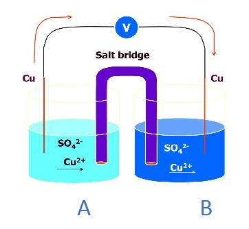

## Theory:
The cell which involves the transfer of matter from one half cell to other due to the difference in concentration of electrolytic solutions, results into the production of electro motive force(EMF) of the cell are known as concentration cell. 
They are classified into following types:

(A)	Electrode concentration cell.

(B)	Electrolyte concentration cell.

SrNo | Electrode (Concentration) | Electrolytic Solution (Concentration) | Electrolytic Solution (Concentration)
:--|:--|:--|:--|
1 |Electrode concentration cell . |Varies in terms of pressure . | Remains Same. 
2 | Electrode concentration cell. | Remains same. | Varies in terms of molarity etc. 

	  
	

	
Electrode: like electrodes (Cu).
Electrolytic solution: Copper sulfate solution (CuSO4).
Cell representation: Cu | Cu+2(a1) || Cu+2(a2) | Cu.

**Working:**

The cell contains a redox reaction  between beaker A & beaker B connected through a salt bridge.
 
Reactions involved in the process:
 
At Anode: Cu → Cu+2(a1) + 2 e-       Oxidation
 
At Cathode: Cu+2(a2) + 2 e- → Cu     Reduction
 
Overall reaction: Cu+2 (a2) → Cu+2(a1)

**Key points:**
(i) The electrolytic solution must have different concentrations. 
(ii) The nature of the electrode depends on the electrolytic solution. 
(iii) Salt bridge is used to prevent diffusion of solution from one half cell to another. 
(iv) Ecell value for spontaneous process is equal to positive. 
(v) If the concentration of electrolytic solution is the same, Ecell = 0. 
(vi) Cathode and anode depend on the concentration of the electrolytic solution. 
				
